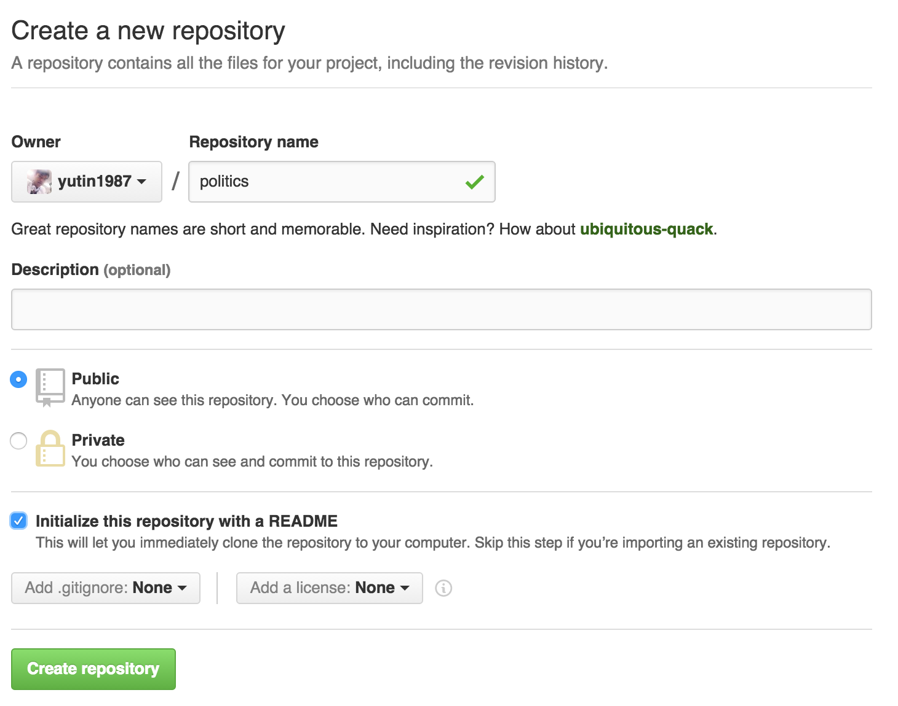
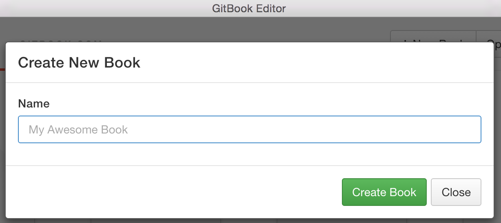
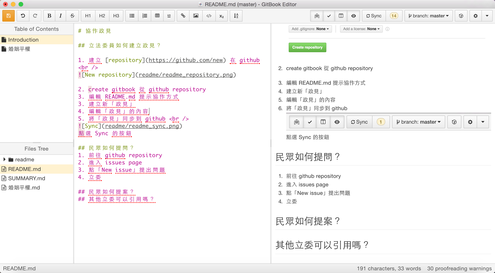
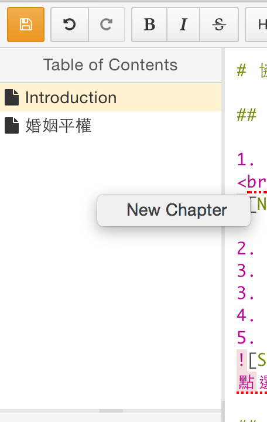

# 協作政見

## 立法委員如何建立政見？

1. 建立 [repository](https://github.com/new) 在 github 

2. create gitbook 從 github repository 

> [下載編輯器](https://www.gitbook.com/editor/)，並建立新Book

3. 編輯 README.md 提示協作方式 

3. 建立新「政見」 

>右鍵點選「New Chapter」，輸入新的政見名稱

4. 編輯「政見」的內容
>編輯方式與步驟3相同

5. 將「政見」同步到 github 

>點選 Sync 的按鈕

## 民眾如何提問？
1. 前往 github repository
2. 進入 issues page
3. 點「New issue」提出問題
4. 立委

## 民眾如何提案？
## 其他立委可以引用嗎？