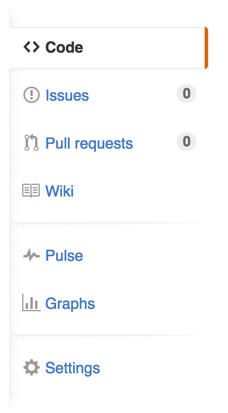
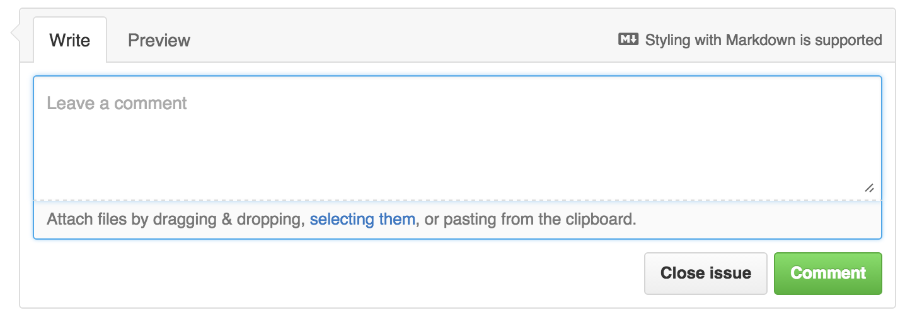
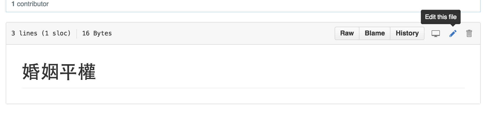
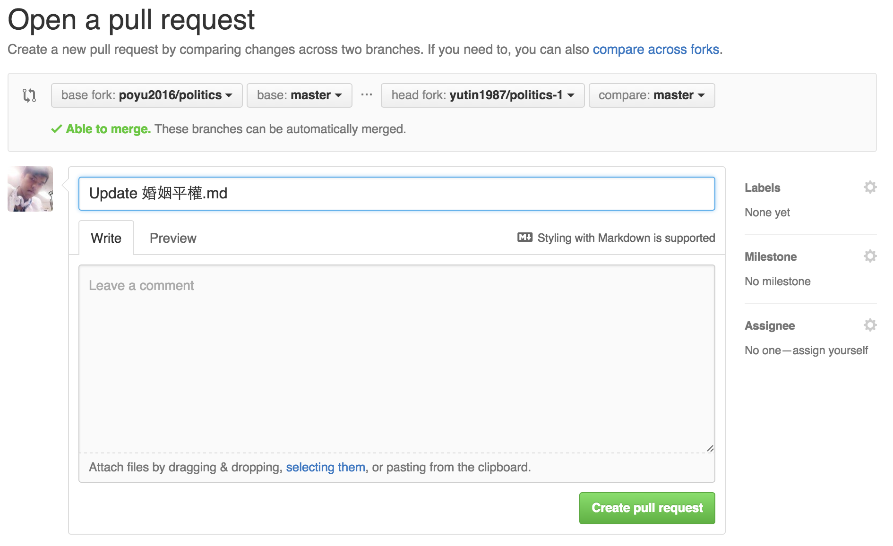
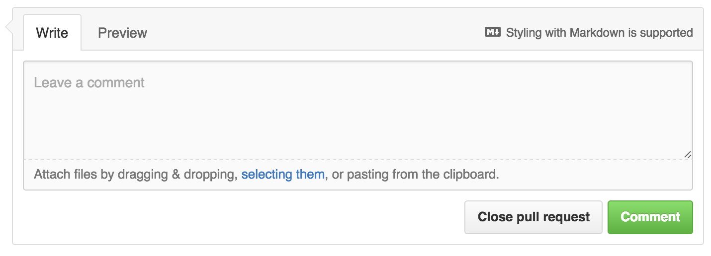
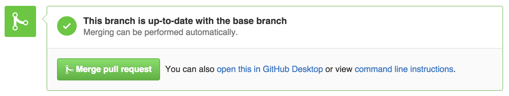

# 協作政見

## 立法委員如何建立政見？

1. 建立 新的[repository](https://github.com/new) 在 github 

2. create gitbook 從 github repository 

> [下載編輯器](https://www.gitbook.com/editor/)，並建立新Book

3. 編輯 README.md 提示協作方式 

3. 建立新「政見」 

>右鍵點選「New Chapter」，輸入新的政見名稱

4. 編輯「政見」的內容
>編輯方式與步驟3相同

5. 將「政見」同步到 github 

>點選 Sync 的按鈕

## 民眾如何提問？
1. 前往 github repository

2. 進入 [issues page](https://github.com/yutin1987/politics/issues) 

3. 點「New issue」提出問題 

4. 其他民眾附議或參與討論 

>民眾提出意見後，按下comment送出

5. 立委回覆問題
>立委也可透過comment回覆民眾

## 民眾如何提案？

1. 將現在的政見建立一個分歧 

>fork立委的repository到民眾自己的repository

2. 民眾在自己的repository編輯政見 

>透過網頁點選鉛筆，進行md(markdown)檔的編輯

3. 提案並說出見解 

>建立pull request，並說出見解

4. 其他民眾服役或參與討論 

>民眾提出意見後，按下comment送出

5. 立法委員參與討論
>立委也可透過comment回覆民眾

6. 決定接受或拒絕 

>Merge pull request表示接受，Close pull request表示拒絕

## 其他立委可以引用嗎？

>可以共同協作並表達願意落實相同的政見

>也可以認同部分政見，然後fork出來修改不認同的部分
